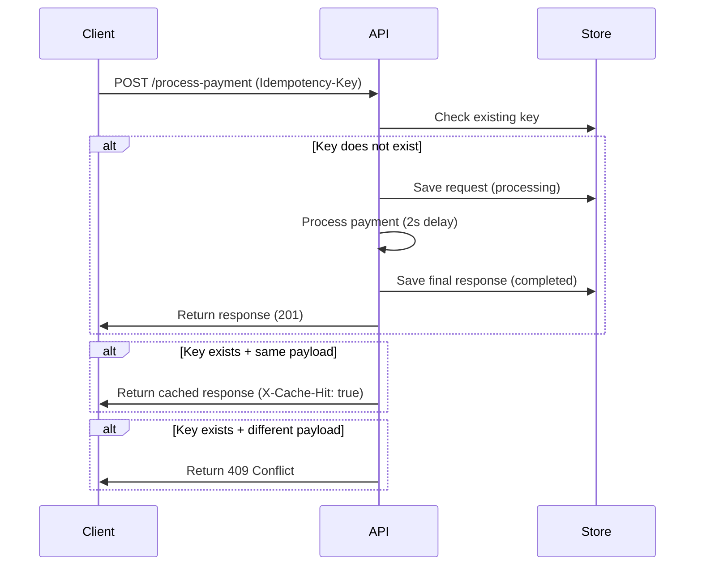

# Idempotency Gateway (Pay-Once Protocol)

## 1. Overview

This project implements an **Idempotency Gateway API** for a payment system.  
It ensures that a payment request is processed **exactly once**, even if the client retries multiple times due to network failures.

This prevents:
- Double charging
- Duplicate transactions
- Retry-based inconsistencies

---

## 2. Architecture Diagram



 ## 3. Setup Instructions

### Install dependencies
```bash
npm install


# Idempotency Gateway

---

## Run Server

```bash
npm start


# Idempotency Gateway

---

## Run Server

```bash
npm start
```

Server runs at:

```text
http://localhost:3000
```

---

## 4. API Documentation

### Endpoint

```text
POST /process-payment
```

---

### Headers

```json
Content-Type: application/json
Idempotency-Key: unique-key-123
```

---

### Request Body

```json
{
  "amount": 100,
  "currency": "RWF"
}
```

---

## 5. Responses

### First Request (201 Created)

```json
{
  "message": "Charged 100 RWF"
}
```

---

### Duplicate Request

**Header:**

```text
X-Cache-Hit: true
```

**Response:**

```json
{
  "message": "Charged 100 RWF"
}
```

---

### Conflict (409)

```json
{
  "error": "Idempotency key already used for a different request body."
}
```

---

## 6. Design Decisions

### 1. Idempotency-Key Strategy

Explain your design here.

---
