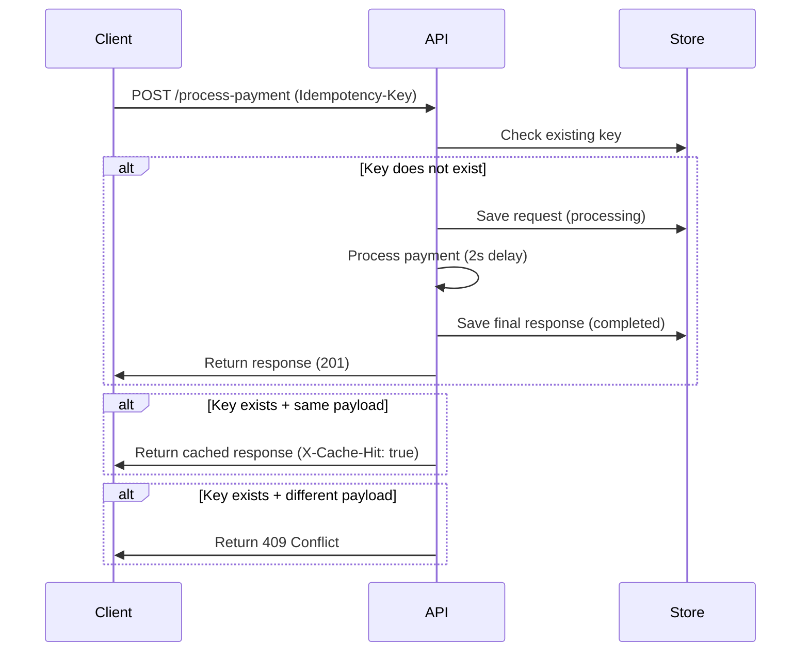

# Idempotency Gateway (Pay-Once Protocol)

## 1. Overview

This project implements an **Idempotency Gateway API** for a payment system.  
It ensures that a payment request is processed **exactly once**, even if the client retries multiple times due to network failures.

This prevents:
- Double charging
- Duplicate transactions
- Retry-based inconsistencies

---

## 2. Architecture Diagram

  3. Setup Instructions
Install dependencies
npm install
Start Redis (if used)
redis-server
Run server
npm start

Server runs at:

http://localhost:3000
4. API Documentation
Endpoint
POST /process-payment
Headers
Content-Type: application/json
Idempotency-Key: unique-key-123
Request Body
{
  "amount": 100,
  "currency": "RWF"
}
5. Responses
First Request (201 Created)
{
  "message": "Charged 100 RWF"
}
Duplicate Request

Header:

X-Cache-Hit: true

Response:

{
  "message": "Charged 100 RWF"
}
Conflict (409)
{
  "error": "Idempotency key already used for a different request body."
}
6. Design Decisions
1. Idempotency-Key Strategy

Used to uniquely identify payment requests.

2. Payload Normalization

Prevents mismatch due to object key order.

function normalize(obj) {
  return JSON.stringify(
    Object.keys(obj)
      .sort()
      .reduce((acc, key) => {
        acc[key] = obj[key];
        return acc;
      }, {})
  );
}
3. Storage Layer

Tracks request states:

processing
completed
4. Conflict Handling

Same key + different payload → 409 Conflict

7. Conclusion

This system demonstrates:

Idempotent API design
Safe retries
Fintech-grade reliability
If the same key is reused with a different payload, the request is rejected with 409 Conflict.
