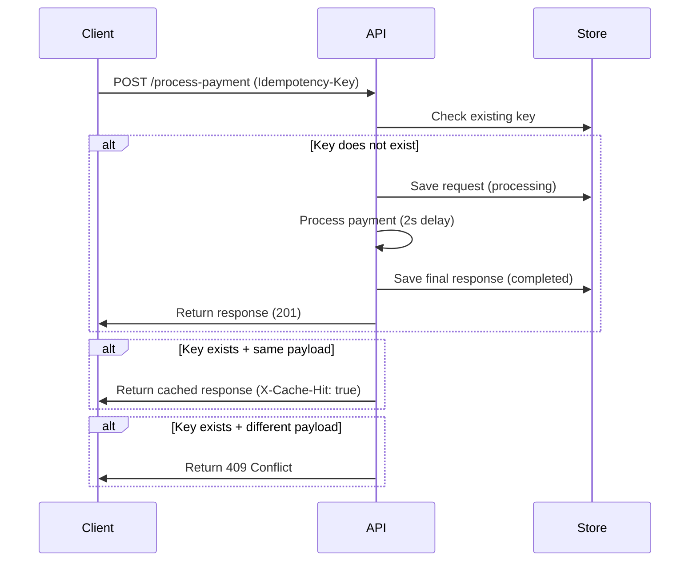

# Idempotency Gateway (Pay-Once Protocol)

## 1. Overview

This project implements an **Idempotency Gateway API** for a payment system.  
It ensures that a payment request is processed **exactly once**, even if the client retries multiple times due to network failures.

This prevents:
- Double charging
- Duplicate transactions
- Retry-based inconsistencies

---

## 2. Architecture Diagram



  ## 3. Setup Instructions

### Install dependencies
```bash
npm install
